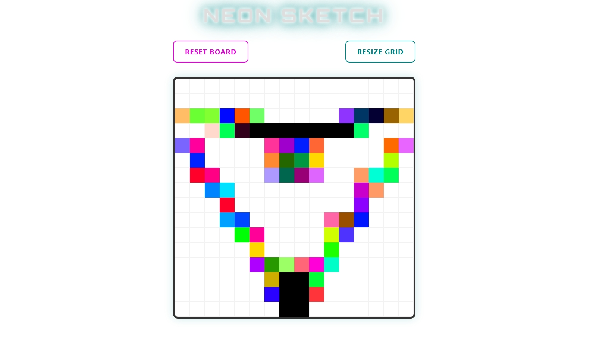

# ⚡ Neon Sketch

**A high-performance, retro-futurist drawing tool built with Vanilla JavaScript.**

Neon Sketch reimagines the classic Etch-a-Sketch with a vibrant "Cyberpunk" aesthetic. It features a dynamic 10-step darkening logic, random HSL color generation, and a responsive grid system that scales from "Retro-Chunky" to "High-Definition."

<p align="center">
  
</p>

---

## ✨ Features

- **Progressive Darkening:** Each pass of the mouse adds 10% opacity/darkness, reaching total black in exactly 10 strokes.
- **Rainbow HSL Logic:** Every square is assigned a unique random hue upon creation, ensuring no two sketches look the same.
- **Customizable Grid:** Users can instantly resize the canvas from $1 \times 1$ up to $100 \times 100$ via an interactive prompt.
- **Neon UI:** A sleek interface featuring **Orbitron** typography and layered CSS "glow" effects.
- **Graceful UX:** Input validation prevents browser crashes from oversized grids, and "Cancel" actions are handled safely.
- **Performance Optimized:** Uses **Event Delegation** and an "Atomic Clear" method to maintain 60fps even with 10,000 active elements.

---

## 🚀 Live Demo

[👉 Click here to play with Neon Sketch!](https://villa116.github.io/odin-etch-a-sketch/)

---

## 🛠️ Technical Deep Dive

### Smart State Management

Unlike basic drawing apps that simply "paint" a color, Neon Sketch uses the HTML5 `dataset` API to store the "memory" of each individual square.

By tracking `data-lightness` independently for every div, the application performs real-time HSL calculations:
$$Lightness_{new} = Lightness_{current} - 10\%$$

### The "Native" Font Stack

To ensure the app feels fast and "built-in" on every operating system, we utilize a professional System Font Stack for the UI components:

```css
font-family:
  -apple-system, BlinkMacSystemFont, "Segoe UI", Roboto, Helvetica, Arial,
  sans-serif;
```

## 💻 Installation & Usage

1. Clone the repo

```bash
git clone git@github.com:Villa116/odin-etch-a-sketch.git
```

2. Enter the folder

```bash
cd odin-etch-a-sketch
```

3. Open index.html in your browser

```bash
open index.html
```

## 🧪 Technologies Used

- **HTML5:** Semantic structure and Data Attributes.
- **CSS3:** Flexbox, Keyframe Animations, Layered Text-Shadows.
- **JavaScript:** DOM Manipulation, Event Listeners, Logic Validation.
- **Google Fonts:** Orbitron (Headings).

Developed with ❤️ by Villa Bukasa
